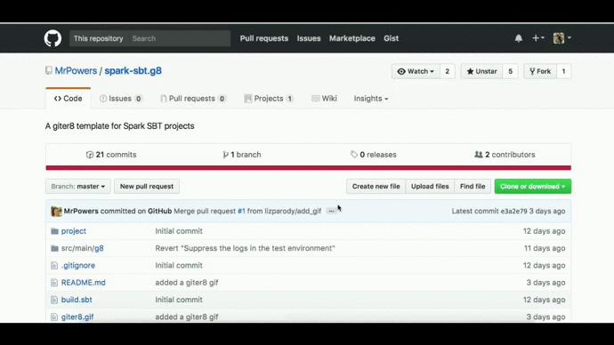

# spark-seed.g8

A [Giter8](https://github.com/foundweekends/giter8) template for Spark SBT applications.

## Usage

1. Install SBT with Homebrew (`brew install sbt`) or with SDKMAN [which is a better option](https://mungingdata.com/java/sdkman-multiple-versions-java-sbt-scala/)

2. Start the app generation wizard: `sbt new aerondir/spark-seed.g8`

3. Fill out the project properties on the command line

4. Run the tests to make sure the project was generated correctly.  `cd` into the top level project directory and then run `sbt test`.

## Project Properties

**name (default: my-cool-project)**

The project name.  This should be all lowercase and use hyphens.

**package (default: com.sample.my.cool.project)**

The top-level package of the project.  This is typically the organization name followed by the project name.

For example, the [top level package of spark-daria](https://github.com/MrPowers/spark-daria/blob/master/src/main/scala/com/github/mrpowers/spark/daria/sql/ColumnExt.scala#L1) is `com.sample.spark.daria`, which consists of the organization name `com.sample` and the project name `spark.daria`.

**scalaVersion (default: 2.12.18)**

**sparkVersion (default: 3.4.1)**

**sbtVersion (default: 1.9.1)**

**version (default: 0.0.1)**

The project version.  `0.0.1` is usually the best place to start.

## Contribution

Send pull requests to keep this project updated.

We'll always try to keep this updated with the latest version of Spark and Scala.

